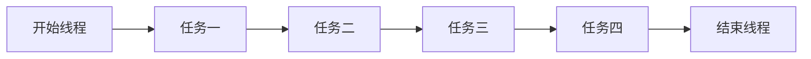

# [Event Loop](https://html.spec.whatwg.org/multipage/webappapis.html#event-loops)

<div class="pt-12">
  <span @click="$slidev.nav.next" class="px-2 py-1 rounded cursor-pointer" hover="bg-white bg-opacity-10">
    <uim-rocket class="text-xl text-white-900 animate-pulse" />
  </span>
</div>

<div class="abs-br m-6 flex gap-2">
  <!-- <button @click="$slidev.nav.openInEditor()" title="Open in Editor" class="text-xl icon-btn opacity-50 !border-none !hover:text-white">
    <carbon:edit />
  </button> -->
  <a href="https://github.com/HydratedPig/EventLoop" target="_blank" alt="GitHub"
    class="text-xl icon-btn opacity-50 !border-none !hover:text-white">
    <carbon-logo-github />
  </a>
</div>

<style>
.slidev-layout h1  {
  -webkit-text-fill-color: unset;
}
h1 a:hover{
  color: white !important;
}
</style>

---

# 单线程的JavaScript
JavaScript从诞生之日起就是一门单线程的非阻塞的脚本语言.
<br/>

<div v-click="1">
为什么是单线程?
</div>

<br/>

<div v-click="2">
试想一下多线程，那么当两个线程同时对dom进行一项操作，例如一个向其添加事件，而另一个删除了这个dom，此时该如何处理呢？因此，为了保证不会发生类似于这个例子中的情景，JavaScript选择只用一个主线程来执行代码，这样就保证了程序执行的一致性。<br/>
</div>

<v-click at="3">

为了更好地理解 JavaScript 的单线程非阻塞，让我们来设计一个单线程的语言吧

</v-click>

---



<v-click at="1">

```go
package main
import "fmt"
func main() {
	task1 := 1
	task2 := task1 + 1
	task3 := task2 + 1
	fmt.Println("task4", task3, task2, task1)
}
```

</v-click>

<arrow v-click="2" x1="200" y1="160" x2="320" y2="70" color="#564" width="3" arrowSize="1" />
<div v-click="2" class="fixed top-30 left-60"><span class="text-3xl">?</span>如何插入一个任务</div>

---

# 事件循环(Event Loop)
```go
package main
import (
	"bufio"
	"fmt"
	"os"
)

func main() {
	reader := bufio.NewReader(os.Stdin)
	for {
		fmt.Println("请输入文本")
		text, _ := reader.ReadString('\n')
		fmt.Println("文本结果:", text)
	}
}
```

<v-click at="1">

这种设计模型有哪些优点呢?

</v-click>
<v-click at="2">

- 引入**循环机制**,通过 while 循环,代码可以一直执行下去
- 引入**事件**,可以接受用户的输入事件并输出信息<br/>
这样子线程就可以"永动"了

</v-click>

---

# 消息队列

刚才的示例中,引入了事件循环机制,线程在执行过程可以接收新的任务执行了,但是,任务都来自于线程内部,如果想接收其他线程发送过来的任务,这种模型是无法做到的<br/>
除了引进事件循环,我们还需要引入消息队列,这样才能让浏览器动起来
<br/>

<div class="text-center w-full justify-center flex flex-wrap">
  <div></div>
  <p v-click="1" class="w-full text-sm">《浏览器工作原理》 15-消息队列和事件循环</p>
</div>

---

# 处理 DOM 事件
试想一下一个典型的场景,监听 DOM 树的变化,并处理相关的业务逻辑.

<v-click at="1">

```js
function listener() {
  console.log('body中子元素被修改');
}
document.body.addEventListener(
  'DOMSubtreeModified',
  listener
);
function appendBody() {
  appendBody.count++;
  document.body.append(`text${appendBody.count}\n`);
}
appendBody.count = 0;
function doOtherTasks() {
  console.log('other tasks');
}
appendBody();
appendBody();
appendBody();
doOtherTasks();
```

</v-click>

---

# 如何权衡处理高优先级任务?

显而易见，刚才例子中 listener 的业务逻辑会阻塞后续的任务执行。如果 listener 业务逻辑处理量大并且和后续任务关联性不大，那么我们没有必要让这些任务阻碍后续业务逻辑的执行，导致执行效率下降。但是如果我们将异步的消息添加到消息队列尾部，又会有新的问题，监控的时效性丢失。那么如何兼顾当前任务的时效性和监控的实时性呢？

<v-click at="1">

### 没错，微任务应运而生

</v-click>

<v-click at="2">

我们把刚才的代码稍作更改

</v-click>

---

```js
function asyncListener() {
  queueMicrotask(() => {
    console.log('body中子元素被修改');
  })
}
document.body.addEventListener(
  'DOMSubtreeModified',
  asyncListener
);
function appendBody() {
  appendBody.count++;
  document.body.append(`text${appendBody.count}\n`);
}
appendBody.count = 0;
function doOtherTasks() {
  console.log('other tasks');
}
appendBody();
appendBody();
appendBody();
doOtherTasks();
```
<v-click at="1">

这样我们在宏任务执行过程中，将 DOM 变化的监听丢进微任务里，在当前宏任务结束之前执行微任务检查去执行微任务，这样既不会影响宏任务继续执行，又保障了监听的时效性，可谓是一举两得。

</v-click>

---

# 宏任务

- 渲染事件(如解析DOM、计算布局、绘制); 
- 用戶交互事件(如鼠标点击、滚动⻚面、放大缩小等);
- JavaScript脚本执行事件;
- 网络请求完成、文件读写完成事件;
- 定时任务（setTimeout、setInterval）。

<v-click at="1">

为了协调这些任务有条不紊地在主线程上执行，⻚面进程引入了消息队列和事件循环机制，渲染进程内部会维护多个消息队列，比如延迟执行队列和普通的消息队列。然后主线程采用一个for循环，不断地从这些任务队列中取出任务并执行任务。我们把这些消息队列中的任务称为宏任务。

</v-click>

---

# [WHATWG 规范定义](https://html.spec.whatwg.org/multipage/webappapis.html#event-loop-processing-model)
宏任务执行过程
- 从 taskQueue 中取出第一个 runnable task 称之为 oldestTask，并将它从 taskQueue 中移除
- 将 oldestTask 设置为 Event Loop 当前正在执行的任务，并记录 taskStartTime
- 执行 oldestTask
- 执行微任务检查点
- 任务完成后统计执行完成的时⻓等信息。

<v-click at="1">

我们刚才提过，作为宏任务放到消息队列中，无法保障时效性，除了无法保障时效性，我们也很难控制任务开始的时间。

</v-click>

---

```js
setTimeout(() => {
  const id = setInterval(() => console.log('interval'), 0)
  function timerCallback4(){
    console.log(4);
  }
  function timerCallback3(){
    console.log(3);
    setTimeout(timerCallback4,0);
  }
  function timerCallback2(){
    console.log(2);
    setTimeout(timerCallback3,0);
  }
  function timerCallback(){
    console.log(1);
    setTimeout(timerCallback2,0);
  }
  setTimeout(timerCallback,0);

  setTimeout(() => clearInterval(id),100);
},4000)
```

<v-click at="1">

很明显 setTimeout 特别容易被插队

</v-click>

<v-click at="2">

试想一下，如果中间被插入的任务执行时间过久的话，那么就会影响到后面任务的执行了。

</v-click>

---

# 微任务

在刚才提到的 [WHATWG](https://html.spec.whatwg.org/multipage/webappapis.html#perform-a-microtask-checkpoint) 规范中，我们可以知道**微任务就是一个需要异步执行的函数，执行时机是在主函数执行结束之后、当前宏任务结束之前。**，如果在执行微任务过程中产生了新的微任务，v8引擎会将该微任务添加到微任务队列中，循环往复，直到队列为空才算结束

<v-click at="1">

现代浏览器中主要有 MutationObserver， Promise，queueMicrotask 产生微任务

</v-click>

---

```js {all|17-21|2-7|10-15|4-6|12-14}
function microTask1() {
  queueMicrotask(() => {
    console.log('1');
    queueMicrotask(() => {
      console.log('3');
    })
  })
}
function microTask2() {
  queueMicrotask(() => {
    console.log('2');
    queueMicrotask(() => {
      console.log('4');
    })
  })
}
queueMicrotask(() => {
  console.log(0);
  microTask1();
  microTask2();
})
```

---

# 回调地狱
```js
function xhrFetch(data, resolve, reject) {
  // ...
}
xhrFetch({},
  function resolve() {
    xhrFetch({},
      function resolve2() {
        xhrFetch({},
          function resolve3() {
            // ...
          },
          function reject3() {
            // ...
          })
      },
      function reject2() {
        // ...
      })
  },
  function reject1() {
    // ...
  })
```

---

# Promise

```js
function xhrFetch(data) {
  // ...
}
const x0 =  xhrFetch({});
const res1 = x0.then(() => {
  return xhrFetch({});
})
const res2 = res1.then(() => {
  return xhrFetch({});
})

res2.catch(error => {
  console.log(error);
})
```
<v-click at="1">

我们可以看到，引入 Promise 后代码变得线性，错误处理也可以被合并到一起

</v-click>

---

# Promise 与微任务

```js
console.log(0);
new Promise(resolve => {
  console.log(1);
  resolve(3);
  console.log(2);
}).then(res => {
  console.log(res);
})
```
<v-click at="1">

众所周知，在 Promise/A+ 规范中：<br/>
- then是在 promise 状态转为 fulfilled 或者 rejected 才会被调用
- then 有两个参数 onFulfilled 和 onFulfilled
- onFulfilled 或 onRejected 不能在执行上下文栈有任务时被调用

</v-click>

<v-click at="2">

根据第三点，易知，```Promise.resolve().then()```需要在下一个任务执行的时机执行，那么这个任务既可以是宏任务，也可以是微任务，但是宏任务执行时机有着极大的不确定性，所以我们的 ```then()```中的参数在微任务中执行

</v-click>

---

# async await

虽然使用Promise让代码执行流程已经线性化了，但是代码里面包含了大量的then函数，使得代码依然不是太容易阅读。基于这个原因，ES7引入了 async/await，这是JavaScript异步编程的一个重大改进，提供了在不阻塞主线程的情况下使用同步代码实现异步访问资源的能力，并且使得代码逻辑更加清晰。

<v-click at="1">

## async

根据MDN定义，async是一个通过异步执行并隐式返回 Promise 作为结果的函数。

我们来看下它是如何返回 promise 的
```js
async function fn() {
  return 1;
}
fn();
// Promise {<fulfilled>: 1}
```

</v-click>

---

## await

```js {all|7|8|2|3|9|4|5|all}
async function fn() {
  console.log(1)
  let a = await 3
  console.log(a)
  console.log(4)
}
console.log(0)
fn()
console.log(2)
```

<v-click at="9">

执行到 await 3 时，会创建一个 Promise 对象，并执行，之后这个任务会被丢进微任务队列里，随后这个 async 函数就被暂停了，继续执行当前宏任务里的剩余部分，直到微任务检查点的执行才重新开始执行

</v-click>

---

# 案例分析

```js {all|1|2-4|5|3|all}
console.log('0');
setTimeout(function(){
  console.log('2');
},0)
console.log('1');
```
<v-click at="6">

```js {all|1|3-5|2-8|9-11|12-14|15-17|18|7|10|13|16|all}
console.log(0);
let p1 = new Promise(function (resolve) {
  console.log(1);
  resolve(4);
  console.log(2);
}).then(function (rt) {
    console.log(rt);
})
let p2 = p1.then(
  () => console.log(5)
);
let p3 = p1.then(
  () => console.log(6)
);
setTimeout(function(){
  console.log(7);
})
console.log(3);
```

</v-click>

---

```js{all|1|20|16-17|10-11|3-7|4-6|11-13|17-18|21|all}
console.log(0);
function getPromise() {
  return new Promise(resolve => {
    console.log(3);
    resolve(6);
    console.log(4);
  })
}
async function f1() {
  console.log(2);
  const a = await getPromise();
  console.log(a);
  return 7;
}
async function f2() {
  console.log(1);
  const a = await f1();
  console.log(a);  
}
f2();
console.log(5);
```

---

# vue的 nextTick

将回调推迟到下一个 DOM 更新周期之后执行。在更改了一些数据以等待 DOM 更新后立即使用它。
```js
import { createApp, nextTick } from 'vue'

const app = createApp({
  setup() {
    const message = ref('Hello!')
    const changeMessage = async newMessage => {
      message.value = newMessage
      await nextTick()
      console.log('Now DOM is updated')
    }
  }
})
```

<v-click at="1">

## 那么 Vue 是如何实现在 DOM 更新周期之后执行的呢？

</v-click>

---

# 谢谢大家

<style>
h1 {
  display: flex;
  justify-content: center;
  align-items: center;
  height: 100%;
}
</style>


---
src: ./additional_1.md
---
